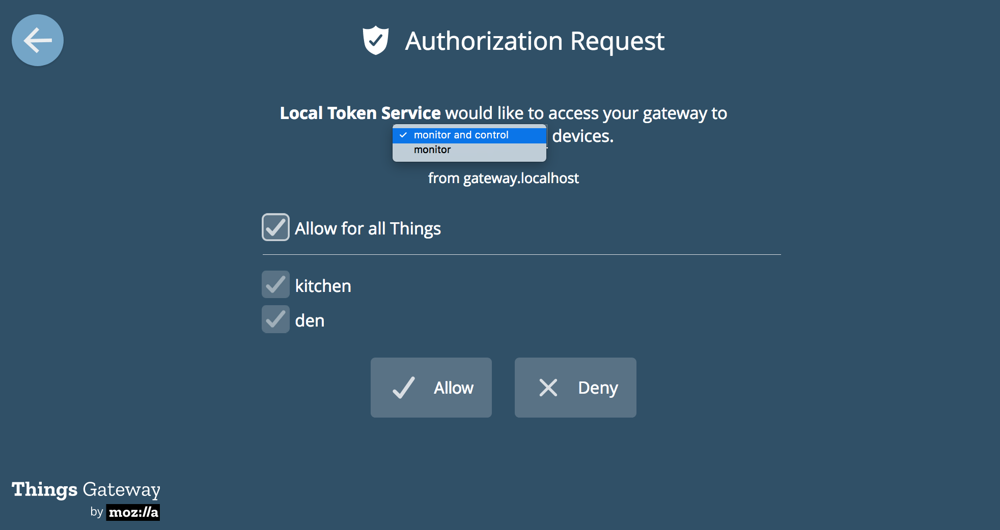

# `telethings`

[Telegraf](https://github.com/influxdata/telegraf) input plugin to read data from a [Webthings IOT gateway](https://iot.mozilla.org/gateway).

## Getting started

### Create an authorization token on your Gateway

On your Gateway, navigate to `Developer` and create an authorization token with monitor access.



### Add to Telegraf

_Todo: Get the binary_

Add a new input section in `telegraf.conf`:

```toml
[[inputs.exec]]
  name_override = "webthings"
  commands = ["/path/to/telethings -t <TOKEN> -u <GATEWAY_URL>"]
  timeout = "5s"
  data_format = "json"
  tag_keys = ["name"]
```

## Development

### Building the binary

`telethings` is packaged using [pkg](npm.im/pkg).

- `npm run build` creates binaries in the `dist` directory.
